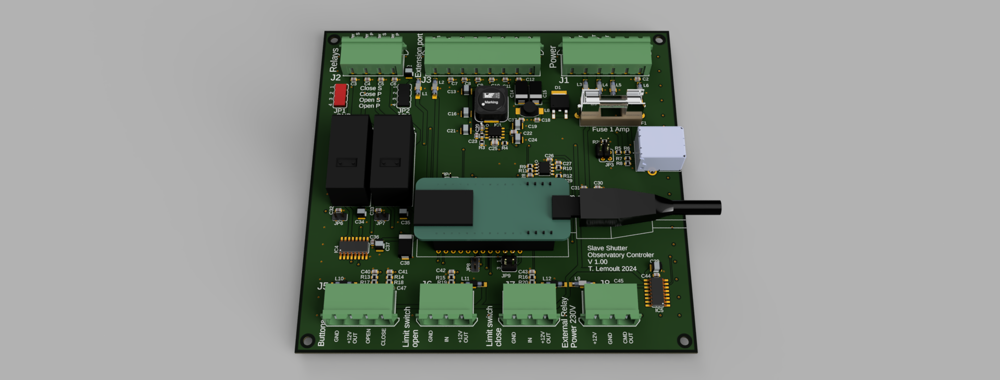
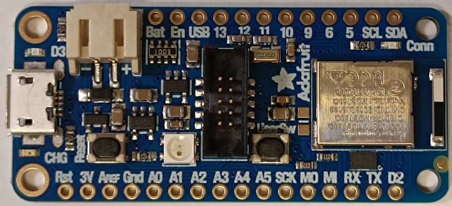
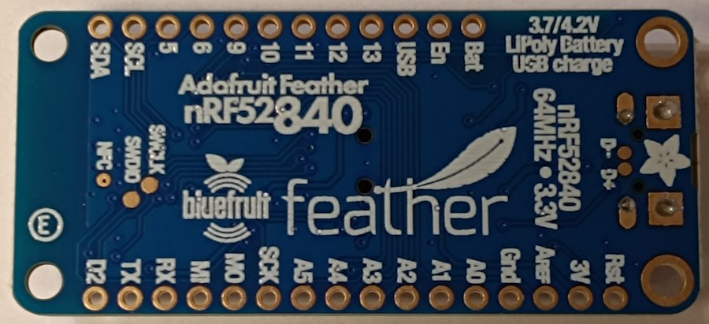

Work in progress.... Experimental
==================================
I test on my desk the main controler, and i build a breakboard slave dome prototype.
Software look working. It's need some more tests.

ArduinoDomeController
=====================

An astronomical observatory dome controller based on two Arduino boards ADAFruit Feather based on Nordic NRF52840.
Each is hosted on an custom home made PCBA motherboard. 

 * The main controller (DomeController)


 * The shutter controller (DomeShutter)


 * architecture 
 


Main controller
---------------

The main controller is connected to a PC by a USB cable or an RS232 port. It uses the MaxDome II serial
protocol for compatibility with existing software.

The mother board provide power supply 5V and 3.V. Power supply filtering and proction. Fuse, reverse protection.
Each port is filtered for EMC immuty and overvoltage protection.

Azimuth angle is read by an optical encoder connected to a rubber wheel that
rotates with the dome. A hall probe is used to detect the "home" mark, wich
serves as an absolute reference for azimuth angle.

The dome is driven by a three-phase motor powered by a variable frequency drive (VFD).
Three digital Arduino pins control the VFD through electromechanical relay,
which are connected to the following terminals in the VFD:

 * Clockwise motion
 * Counterclockwise motion
 * Jog (slow motion)
 
For more details, read the definitions in [DomeController.ino](DomeController/pins.h).

### RS232 Serial port definition

The USB port is used for bootloader and console.
The maxdome communication port is an RS232 uart. We use the Serial1 arduino object. And we change the default ADAfruit serial port pin of "Serial1".

In a windows installation arduino look into this file the following modification:
into this file the following modification:
 * windows OS: ``C:\Users\youruser\AppData\Local\Arduino15\packages\adafruit\hardware\nrf52\1.6.1\variants\feather_nrf52840\variant.h``
 * linux OS: ``~/.arduino15/packages/adafruit/hardware/nrf52/1.6.1/variants/feather_nrf52840/variant.h``

```
#define PIN_SERIAL1_RX       (15)
#define PIN_SERIAL1_TX       (14)
```


Shutter controller (slave controler)
------------------

The shutter controller is powered by
a 12v lead-acid battery. The battery can be charged with

 * a solar panel (the solution I am using).
 * a trickle charger wich is connected to the battery when the dome is
   in the home position using two brushes.

A high efficiency DC/DC provide 5V DC form 12V battery.

The shutter controller communicates with the main board thru UART over BLE

 
 

Switched power supply of the motor:
An open collector @ 12V drive a external 12V power relay. The power contact of this relay supplies an inverter which outputs 230V AC.
The 230V AC is used to power a variable speed drive for a three-phase asynchronous motor.
The speed controller is operated through its digital inputs for forward and reverse motion.
These inputs are activated by 2 relays integrated into the slave controller board.


Two limit switches are used. 
 * Shutter fully closed
 * Shutter fully open

There is 2 button to manually command openning and close of the shutter.

There is extension port with 6 free I/O of the microcontroler for future extension. Like an driver for a 12V motor.

