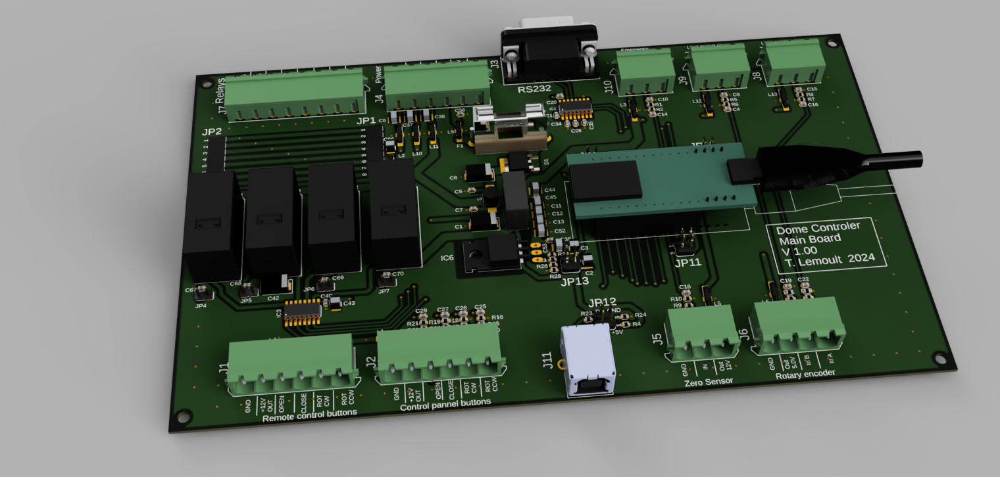
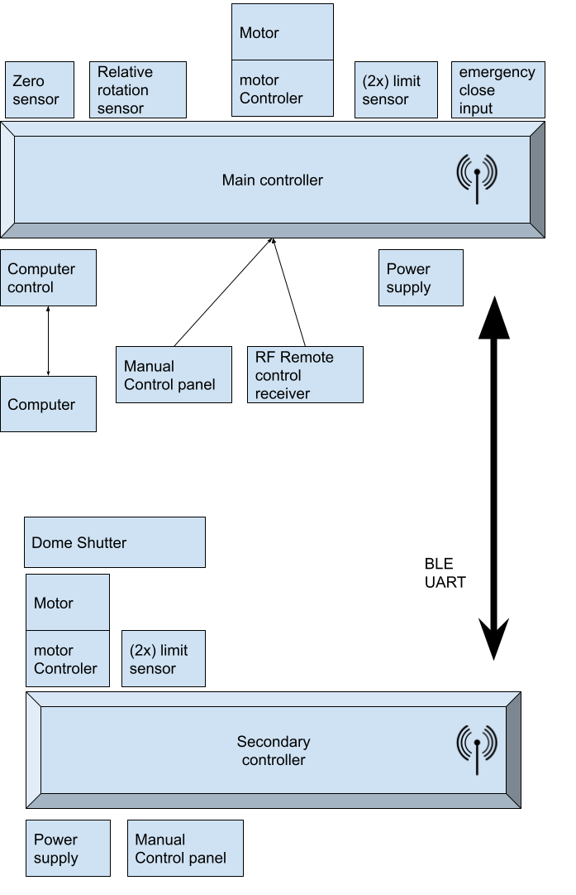
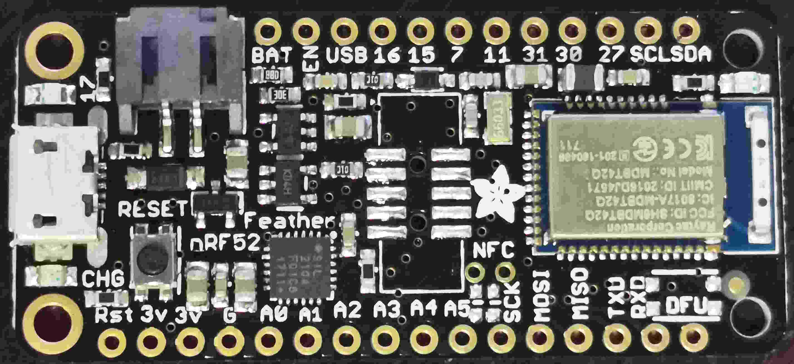

ArduinoDomeController
=====================

An astronomical observatory dome controller based on two Arduino boards ADAFruit Feather based on nordic NRF52832.
Each is hosted on an custom home made PCBA motherboard. 

 * The main controller (DomeController)
 * The shutter controller (DomeShutter)
 * 

 

Main controller
---------------

The main controller is connected to a PC by a USB cable or an RS232 port. It uses the MaxDome II serial
protocol for compatibility with existing software.

The mother board provide power supply 5V and 3.V. Power supply filtering and proction. Fuse, reverse protection.
Each port is filtered for EMC immuty and overvoltage protection.

Azimuth angle is read by an optical encoder connected to a rubber wheel that
rotates with the dome. A hall probe is used to detect the "home" mark, wich
serves as an absolute reference for azimuth angle.

The dome is driven by a three-phase motor powered by a variable frequency drive (VFD).
Three digital Arduino pins control the VFD through electromechanical relay,
which are connected to the following terminals in the VFD:

 * Clockwise motion
 * Counterclockwise motion
 * Jog (slow motion)
 
For more details, read the definitions in [DomeController.ino](DomeController/DomeController.ino).

Shutter controller (slave controler)
------------------

The shutter controller is mounted in the rotating dome and it is powered by
a 12v lead-acid battery. The battery can be charged with

 * a solar panel (the solution I am using).
 * a trickle charger wich is connected to the battery when the dome is
   in the home position using two brushes.

The shutter controller communicates with the main board by means of UART over BLE

 

Shutter motor or flap motors can be controlled by any means like:
* For DCmotors [Monster Moto Shield](https://www.sparkfun.com/products/10182).

Five limit switches are used. Pin numbers are defined in [DomeShutter.ino](DomeShutter/DomeShutter.ino).

 * Shutter fully closed
 * Shutter fully open
 * Flap closed
 * Flap fully open
 * Flap and shutter mechanical interference

The 4-button keyboard in the shutter controller 

